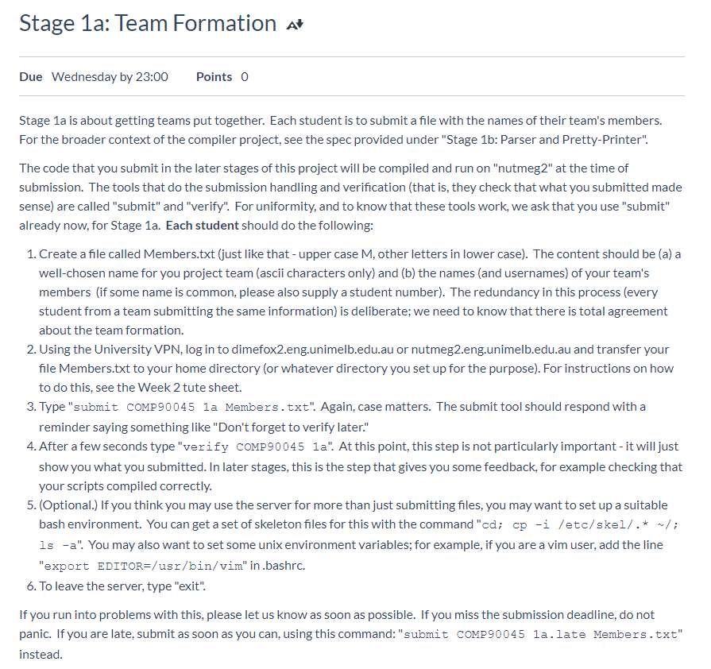
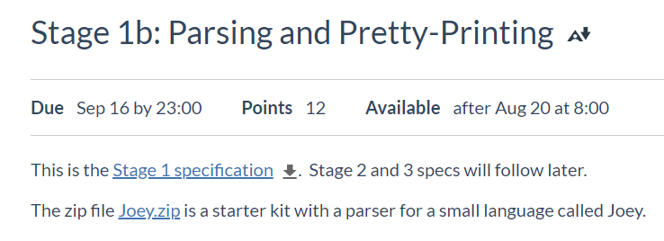

# Roo-compiler
<!-- ALL-CONTRIBUTORS-BADGE:START - Do not remove or modify this section -->
[](#contributors-)
<!-- ALL-CONTRIBUTORS-BADGE:END -->
COMP90045 - Programming language implementation - 2020S2 - Assignment1&amp;2

[Team info](./Members.txt)

## Contributors ✨

Thanks goes to these wonderful people ([emoji key](https://allcontributors.org/docs/en/emoji-key)):

<!-- ALL-CONTRIBUTORS-LIST:START - Do not remove or modify this section -->
<!-- prettier-ignore-start -->
<!-- markdownlint-disable -->

<table>
  <tr>
    <td align="center"><a href="https://yangxvlin.github.io"><br /><sub><b>XuLinYang</b></sub></a><br /><a href="https://github.com/yangxvlin/Roo-compiler/commits?author=yangxvlin" title="Code">💻</a></td>
    <td align="center"><a href="https://github.com/knll9311"><br /><sub><b>knll9311</b></sub></a><br /><a href="https://github.com/yangxvlin/Roo-compiler/commits?author=knll9311" title="Code">💻</a></td>
    <td align="center"><a href="https://github.com/Chaoszzz"><br /><sub><b>Chaoszzz</b></sub></a><br /><a href="https://github.com/yangxvlin/Roo-compiler/commits?author=Chaoszzz" title="Code">💻</a></td>
    <td align="center"><a href="https://github.com/JackyWenruiZhang"><br /><sub><b>JackyWenruiZhang</b></sub></a><br /><a href="https://github.com/yangxvlin/Roo-compiler/commits?author=JackyWenruiZhang" title="Code">💻</a></td>
  </tr>
</table>

<!-- markdownlint-enable -->
<!-- prettier-ignore-end -->
<!-- ALL-CONTRIBUTORS-LIST:END -->

This project follows the [all-contributors](https://github.com/all-contributors/all-contributors) specification. Contributions of any kind welcome!

## repository structure
- ```/2a submit```: submission to project 2a with personal info removed
- ```/docs```: documentation & specification
- ```/Joey```: Joey is a subset language of Roo, provided as skeleton code
- ```/Roo```: implemented Roo parser

## specifications
### stage 1a
- 
- ``` submit COMP90045 1a ```

### stage 1b
- 
- [specification 1](./docs/asg1.pdf)
#### how to submit
- ``` submit COMP90045 1b Makefile Roo.hs RooAST.hs PrettyRoo.hs RooParser.hs ```
- ``` verify COMP90045 1b | less ```
#### tasks
- Roo has global type definitions for aggregate types (records and arrays), but there are no global variables. 
- One (parameterless) procedure must be named "main".
- has three base types
  - The "write" and "writeln" commands can print inhabitants of all three base types. (showable)
  - integer
    - allows a number of operators:
      - arithmetic and 
      - comparison
  - boolean
    - has two inhabitants, false and true
    - These values are ordered, so that x <= y iff x is false or y is true (or both).
    - So the six comparison operators (<, <=, ==, !=, >=, >) can also be applied to Boolean values (the arithmetic operators can not).
  - string.
    - No variables can have string type, and 
    - no operations are available on strings.
    - string literals are available, so that meaningful messages can be printed from a Roo program.
  - There are two aggregate types, 
    - records
      - cannot be nested; 
      - in fact, record fields can only have type 
        - integer or 
        - boolean.
    - arrays.
      - All arrays are one-dimensional, and 
      - are static in the sense that the size of an array is determined at compile time.
      - An array of size n uses indices 0 to n-1.
      - Arrays are homogeneous: all elements of a Roo array must have the same type.
      - The element type can be 
        - integer, 
        - boolean, or a 
        - record type.
- reserved words: and, array, boolean, call, do, else, false, fi, if, integer, not, od, or, procedure, read, record, then, true, val, while, write, writeln.
- An identifier is a non-empty sequence of alphanumeric characters, under-score and apostrophe ('), and it must start with a (lower or upper case) letter. 
- An integer literal is a sequence of digits, possibly preceded by a minus sign.
- A boolean literal is false or true.
- A string literal is a sequence of characters between double quotes.
  - The sequence itself cannot contain double quotes or newline/tab characters. It may, however, contain '\" ', '\n', and '\t', respectively, to represent those characters.
- The arithmetic binary operators associate to the left, and unary operators have higher precedence. 
  - It follows, for example, that '-5+6' and '4-2-1' both evaluate to 1.
- field declaration 
  - is of 
    - boolean or 
    - integer, 
  - followed by an identifier (the field name).
  - ```
        integer client_number
    ```
- record:
  - 1. the keyword record,
  - 2. a non-empty list of field declarations, separated by semicolons, the whole list enclosed in braces,
  - 3. an identifier, and
  - 4. a semicolon.
  - ```
    record
        { integer client_number
        ; integer balance
        ; boolean approved
        } account;
    ```
- array type definition consists of (in the given order):
  - 1. the keyword array,
  - 2. a (positive) integer literal enclosed in square brackets,
  - 3. a type name which is either an identifier (a type alias) or one of boolean and integer,
  - 4. an identifier (giving a name to the array type), and
  - 5. a semicolon.
  - ```
    array[10] integer tax;
    array[10] account account_array;
    ```
- Each procedure consists of (in the given order):
  - 1. the keyword procedure,
  - 2. a procedure header, and
    - ```main()``` below
  - 3. a procedure body. 
  - ```
    procedure main()
        integer x;
        integer A_38;
        boolean mood;
    {
        write "Give us a number, please: ";
        read x;
        write "And another: ";
        read A_38;
        write "Happy and you know it (true/false): ";
        read mood;
        write mood;
        write "\nYour first number was ";
        write x;
        write "\n";
    }
    ```
- The header has two components (in this order):
  - 1. an identifier (the procedure's name), and
  - 2. a comma-separated list of zero or more formal parameters within a pair of parentheses (so the parentheses are always present).
  - ```
    main()
    ```
    above
  - ```
    func(account account_array, boolean variable1, integer variable2, boolean val, true, false, 123, -456)
    ```
- Each formal parameter has two components (in the given order):
  - 1. a parameter type/mode indicator, which is one of these five: 
    - a type alias, 
    - boolean, 
    - integer, 
    - boolean val, or 
    - integer val,
  - 2. and an identifier.
- procedure body 
  - consists of 0+ local variable declarations,
    - A variable declaration consists of 
      - a type name (boolean, integer, or a type alias), 
      - followed by a non-empty comma-separated list of identifiers, 
        - the list terminated with a semicolon. 
        - There may be any number of variable declarations, in any order.
    - ```
      integer i, n, bal;
      account_array a;
      integer to_pay;
      tax t;
      ```
  - followed by a non-empty sequence of statements, 
  - the statements enclosed in braces.
  - ```
    procedure main()  
    # below are body
        integer x;
        integer A_38;
        boolean mood;
    {
        write "Give us a number, please: ";
        read x;
        write "And another: ";
        read A_38;
        write "Happy and you know it (true/false): ";
        read mood;
        write mood;
        write "\nYour first number was ";
        write x;
        write "\n";
    }
    ```
- compiler
  - If the input program has lexical/syntax errors, it should not be pretty-printed; instead suitable error messages should be produced.
  - The main program that you need to create is Roo.hs which will eventually be developed to a full compiler.
- pretty printer

### stage 2
- [specification](./docs/asg2.pdf)
