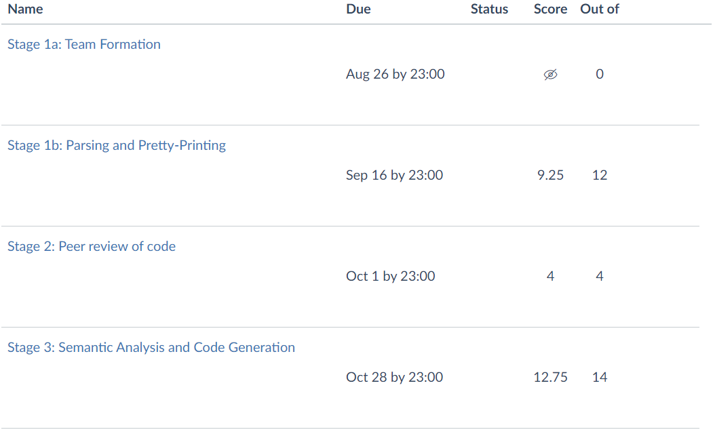

# Roo-compiler
<!-- ALL-CONTRIBUTORS-BADGE:START - Do not remove or modify this section -->
[](#contributors-)
<!-- ALL-CONTRIBUTORS-BADGE:END -->
COMP90045 - Programming language implementation - 2020S2 - Assignment1&amp;2

[Team info](./Members.txt)

## Contributors ✨

Thanks goes to these wonderful people ([emoji key](https://allcontributors.org/docs/en/emoji-key)):

<!-- ALL-CONTRIBUTORS-LIST:START - Do not remove or modify this section -->
<!-- prettier-ignore-start -->
<!-- markdownlint-disable -->

<table>
  <tr>
    <td align="center"><a href="https://yangxvlin.github.io"><br /><sub><b>XuLinYang</b></sub></a><br /><a href="https://github.com/yangxvlin/Roo-compiler/commits?author=yangxvlin" title="Code">💻</a></td>
    <td align="center"><a href="https://github.com/knll9311"><br /><sub><b>knll9311</b></sub></a><br /><a href="https://github.com/yangxvlin/Roo-compiler/commits?author=knll9311" title="Code">💻</a></td>
    <td align="center"><a href="https://github.com/Chaoszzz"><br /><sub><b>Chaoszzz</b></sub></a><br /><a href="https://github.com/yangxvlin/Roo-compiler/commits?author=Chaoszzz" title="Code">💻</a></td>
    <td align="center"><a href="https://github.com/JackyWenruiZhang"><br /><sub><b>JackyWenruiZhang</b></sub></a><br /><a href="https://github.com/yangxvlin/Roo-compiler/commits?author=JackyWenruiZhang" title="Code">💻</a></td>
  </tr>
</table>

<!-- markdownlint-enable -->
<!-- prettier-ignore-end -->
<!-- ALL-CONTRIBUTORS-LIST:END -->

This project follows the [all-contributors](https://github.com/all-contributors/all-contributors) specification. Contributions of any kind welcome!

## marks
- 

## repository structure
- ```/2a submit```: submission to project 2a with personal info removed
- ```/docs```: documentation & specification
- ```/Joey```: Joey is a subset language of Roo, provided as skeleton code
- ```/Roo```: implemented Roo parser
  - [Main function](./Roo/Roo.hs)
  - [Abstract syntax tree](./Roo/RooAST.hs)
  - [Scanner and Parser](./Roo/RooParser.hs)
  - [Pretty printer](./Roo/PrettyRoo.hs)
  - [Symbol table](./Roo/SymbolTable.hs)
  - [Semantic schecker](./Roo/RooAnalyser.hs)
  - [Oz code representation (intermediate code)](./Roo/OzCode.hs)
  - [Oz code generator (intermediate code generator)](./Roo/Codegen.hs)
## specifications
### stage 1a
- 
- ``` submit COMP90045 1a ```

### stage 1b
- 
- [specification 1](./docs/asg1.pdf)
#### how to submit
- ``` submit COMP90045 1b Makefile Roo.hs RooAST.hs PrettyRoo.hs RooParser.hs ```
- ``` verify COMP90045 1b | less ```
#### stage 1 result
- [result](./docs/stage&#32;1&#32;result/all_files.pdf)

### stage 2
- [specification](./docs/asg2.pdf)

### stage 3a
#### how to submit
- ``` submit COMP90045 3a xuliny.roo xuliny.in ```
- ``` verify COMP90045 3a | less ```

### stage 3b
- [specification](./docs/asg3.pdf)
#### how to submit
- ``` submit COMP90045 3b Makefile Roo.hs RooAST.hs PrettyRoo.hs RooParser.hs RooAnalyser.hs SymbolTable.hs Codegen.hs OzCode.hs ```
- ``` verify COMP90045 3b | less ```

#### testing on netmug
- ``` ./Roo/Roo ./roo_examples/contrib/xuliny.roo > out.oz ```
- ``` ./oz/oz out.oz < ./roo_examples/contrib/xuliny.in ```

